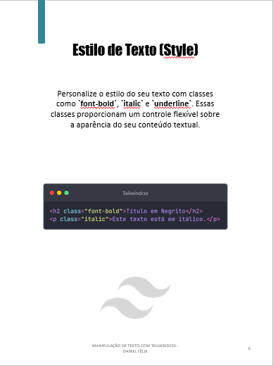

# Projeto EBOOK Gerado por I.A.s

 > ℹ️ **NOTE:** Este é o repositório de um desafio desenvolvido durante o curso na plataforma da [DIO](https://dio.me)

Projeto com o objetivo de gerar um ebook digital com as facilidades das ferramentas de IA. todos os prompts
seguem abaixo.

<a href="https://github.com/danielfelix45/prompts-for-creating-an-ebook/blob/master/output/ebook%20-%20tailwindcss(manipula%C3%A7%C3%A3o%20de%20texto).pdf" title="View PDF now"> 📕Clique aqui para ler</a>

## 💻 Tecnologias utilizadas no projeto

- [ChatGPT](https://chat.openai.com/) 
- [Microsoft Bing](https://www.bing.com/images/create)
- [PowerPoint](https://www.microsoft.com/en/microsoft-365/powerpoint)

## 🧠 Prompts

ChatGPT：

|   Ação   | prompt                                                                                                                                                                                                                                                                         |
| :------: | ------------------------------------------------------------------------------------------------------------------------------------------------------------------------------------------------------------------------------------------------------------------------------ |
|  título  | Crie um título de um ebook sobre o tema de tailwindcss, o ebook é do nicho de programação e o subnicho é de css, o título deve ser chamativo e curto, e que tenha uma temática informal, me liste 10 variações de titulos                                                        |
| conteúdo | Faça um texto para ebook, com foco em tailwindcss, listando as principais classes de  manipulação de texto com tailwindcss, com exemplos de codigo {REAGRAS} Explique de uma maneira simples, Deixe o texto enxuto, Sempre traga exemplo de código em contextos reais, Deixe um texto sugestivo por tópico |

Bing：

|  Ação  | prompt                                                                                 |
| :----: | -------------------------------------------------------------------------------------- |
| título | A web developer discovering tailwindcss technology, show the tailwindcss logo |

## ✨ Features

- Conteúdo gerado via ChatGPT
- Imagens geradas via Microsoft Bing

## 📚 Materiais

- Imagens utilizadas em `assets`
- ebook gerado durante as aulas em `output`

## 🛠️ Instruções de execução

Utilize os prompts acima nas ferramentas sugeridas para gerar o material base e utilize uma ferramenta de edição de documentos como power point, libreoffice , indesign para diagramação.

---

⌨️ com 💜 por [Felipe Aguiar](https://github.com/felipeAguiarCode)